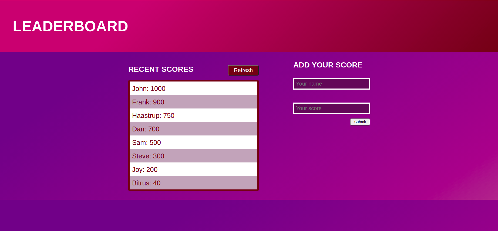

# leaderboard

A JavaScript project for the Leaderboard list app, using webpack and ES6 features, notably modules.

## Built With

- HTML
- CSS
- Javascript ES6

[Live Link](https://whoistolu.github.io/leaderboard/dist/)

## To get a local copy run the following steps:
- Copy this link [this link](https://github.com/Whoistolu/leaderboard)
- Open your terminal or command line
- Run "git clone Paste [this link](https://github.com/Whoistolu/leaderboard)"
- Open the folder with your code editor
- Create a branch to work on
- Run `npm run build`
- Run `npm start` to start the server
- Or open the `index.html` file in the dist directory with liveserver

## Authors

👤 **Author1**

- Name: Ajise Toluwase
- GitHub: [@githubhandle](https://github.com/Whoistolu)
- Twitter: [@twitterhandle](https://twitter.com/Littletolu)
- LinkedIn: [LinkedIn](https://www.linkedin.com/in/toluwase-ajise-9b40411b2/)

## 🤝 Contributing

Contributions, issues, and feature requests are welcome!

## Show your support

Give a ⭐️ if you like this project!

## Acknowledgments

- Hat tip to anyone whose code was used
- Inspiration

## 📝 License

This project is [MIT](./MIT.md) licensed.

